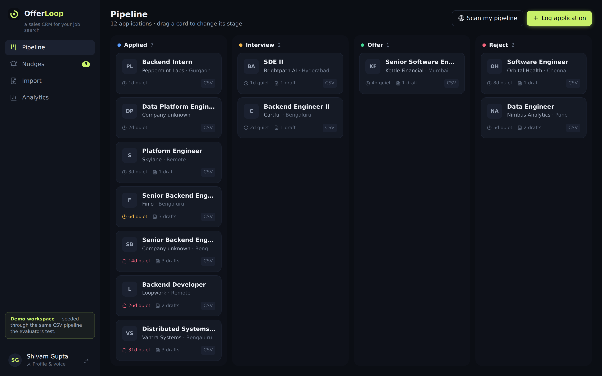
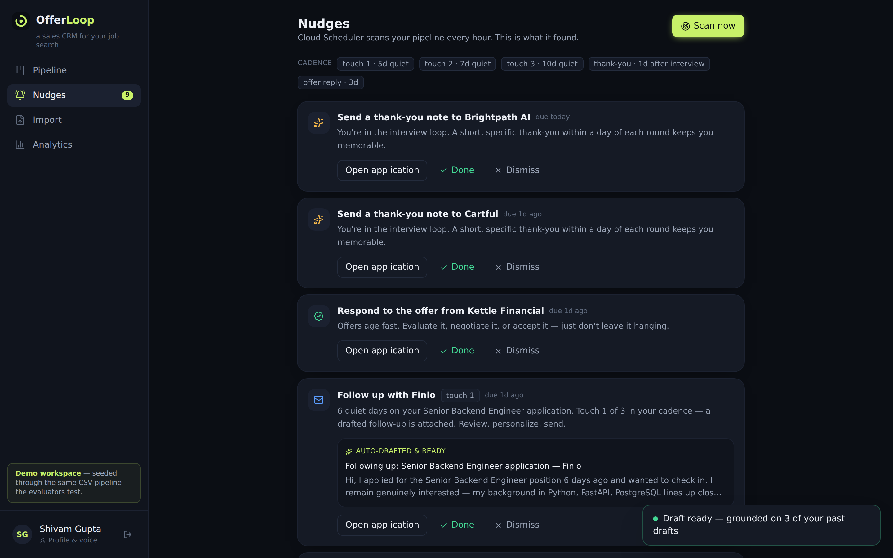
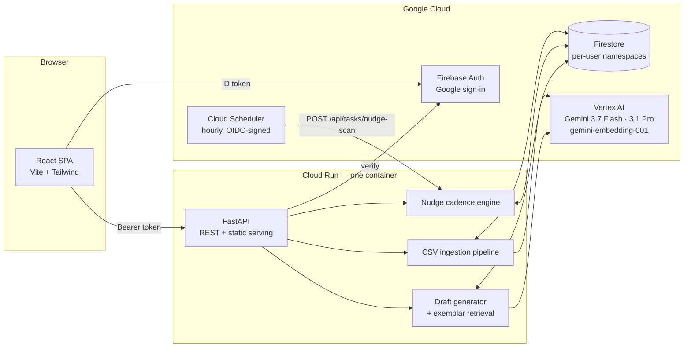

<div align="center">

# ◎ OfferLoop

### A sales CRM for your job search

**Sales teams never forget to follow up. Now you won't either.**

Built end-to-end on Google Cloud for **Code Kitchen Season 01** · Track: *AI Job Application Tracker*

[](.github/workflows/ci.yml)
[](backend/app/services/llm.py)
[](infra/deploy.sh)
[](LICENSE)



</div>

---

## The problem

75% of job applications disappear into silence. Not because candidates aren't good — because they
don't *work* their applications. They apply, they wait, they get ghosted, they lose track in a
spreadsheet.

Sales teams solved this exact problem decades ago: a pipeline with stages, automated cadences,
and follow-ups that go out on schedule, every time. **OfferLoop gives job seekers that same
engine.**

## What it does

| | |
|---|---|
| **Pipeline board** | Drag applications through Applied → Interview → Offer / Reject. Every transition is recorded with a timestamped, annotated history. |
| **AI outreach that sounds like you** | Gemini **3.1 Pro** writes cover letters; **3.7 Flash** writes follow-ups — grounded on the posting, your profile, *and your own past drafts*, retrieved by hybrid semantic + lexical search. Every draft shows its provenance ("grounded on 3 past drafts"). |
| **Scheduled nudges** | **Cloud Scheduler** scans every pipeline hourly. Quiet applications trigger a 3-touch follow-up cadence (5 → 7 → 10 days) with the follow-up email *already drafted and attached*. Interviews trigger thank-you nudges; offers and rejections get their own rules. Idempotent by construction — a rerun never double-nudges. |
| **Bulk CSV ingestion** | Drop postings (`id, from, to, type, description`) and drafts (`id, jobId, type, contents, status`). Gemini Flash structures free-text descriptions in batched calls, drafts link to postings by `jobId`, orphans are kept and flagged, bad rows are rejected individually with reasons, and re-imports update instead of duplicating. |
| **Funnel analytics** | Interview rate, offer rate, median days-to-interview, ghost rate, weekly momentum — your search measured like a sales funnel. |

<div align="center">

</div>

## Architecture

One container. One Cloud Run service. Scales to zero when nobody is job hunting at 3 a.m. — and
wakes the moment Cloud Scheduler fires.



**Design decisions that matter:**

- **Adapter seams everywhere.** Storage (`Firestore ⇄ in-memory`), intelligence
  (`Gemini ⇄ deterministic templates`), and auth (`Firebase ⇄ demo identity`) are swappable via
  one env var. That's why the entire product — including the evaluation pipeline — runs and is
  tested in CI with zero credentials, then switches to full GCP with `OFFERLOOP_APP_MODE=live`.
- **Model routing with a fallback chain.** High-volume structured work (posting extraction,
  follow-ups) goes to `gemini-3.7-flash`; the highest-stakes artifact — the cover letter — goes to
  `gemini-3.1-pro-preview`. Every call degrades along
  `3.1 Pro → 2.5 Pro → 3.7 Flash` instead of failing, and extraction falls back to regex so a
  model outage can never break an import.
- **Idempotency as structure, not discipline.** Nudges are keyed by deterministic dedupe keys and
  the store refuses duplicates; CSV rows carry their external id so re-imports update in place.
  Scheduler retries and judge re-runs are harmless by design.
- **The demo seed *is* the evaluation pipeline.** Demo mode boots by ingesting
  [`data/sample_postings.csv`](data/sample_postings.csv) and
  [`data/sample_drafts.csv`](data/sample_drafts.csv) through the exact same importer the
  evaluators will exercise. No hand-planted fixtures.

## Try it in 60 seconds (no GCP account needed)

```bash
git clone https://github.com/shi1720/code-kitchen.git && cd code-kitchen
make install     # backend venv + frontend npm install
make build       # production frontend bundle
make api         # http://localhost:8000 — demo workspace, seeded via the CSV pipeline
```

Or with Docker — exactly what Cloud Run runs:

```bash
make docker && make docker-run    # http://localhost:8080
```

Click **Enter OfferLoop** and you're inside a seeded workspace: 12 imported postings, 16
historical drafts, and a live nudge inbox. Then go to **Import** and hit **Load sample datasets →
Run import** to watch the evaluation pipeline run end to end — and hit it again to see
idempotency in action.

## Deploying to Google Cloud

```bash
PROJECT_ID=your-project ./infra/deploy.sh
```

The script enables APIs, creates Firestore, sets up least-privilege service accounts, deploys to
Cloud Run from source, and wires the hourly Cloud Scheduler job (OIDC-authenticated). Full
runbook with the Firebase Auth step: [docs/DEPLOYMENT.md](docs/DEPLOYMENT.md).

## For evaluators

**[docs/EVALUATION.md](docs/EVALUATION.md)** maps every requirement in the problem statement to
the code, tests, and the exact `curl`/UI path to verify it — including how to run your own CSV
datasets through the pipeline.

## Testing

```bash
make test    # 60 backend tests (pytest) + 5 frontend tests (vitest)
make lint    # ruff + tsc --noEmit
```

The importer is tested against the messy realities of the evaluation schema: unquoted commas
inside descriptions (as in the problem statement's own examples), `<id>`-style angle-bracket
headers, UTF-8 BOM, CRLF, multiline quoted contents, mixed date formats, unknown type labels,
per-row failures, and idempotent re-imports. The nudge engine is tested for cadence backoff,
dedupe idempotency, budget caps, and the staleness-clock semantics. A Playwright tour drives the
full UI against the running stack.

## Project structure

```
backend/
  app/
    main.py            FastAPI app factory + SPA serving
    config.py          every knob, env-driven
    auth.py            Firebase ID-token verify · demo identity · Scheduler OIDC gate
    models.py          domain models mirroring the evaluation schemas
    repos/             Repo protocol · MemoryRepo · FirestoreRepo (batched writes)
    services/
      llm.py           Gemini adapter (routing, fallbacks, batching) + template fallback
      ingest.py        the CSV pipeline
      nudges.py        the cadence engine
      retrieval.py     hybrid exemplar retrieval (embeddings + lexical)
      generation.py    grounded draft generation with provenance
      analytics.py     funnel math
    routers/           applications · drafts · imports · nudges · analytics · tasks
  tests/               60 tests
frontend/
  src/                 React 19 + TypeScript + Tailwind 4 (validated dataviz palette)
data/                  sample datasets in the evaluation schema
infra/                 deploy.sh · Cloud Scheduler wiring · Firestore rules · env reference
docs/                  architecture · deployment · evaluation guide · screenshots
```

## Commercial viability

OfferLoop is an MVP with a real market: job-search CRMs like Teal and Huntr have paying users,
and the "cadence" mechanic — borrowed from sales tools like Outreach — is the wedge none of the
spreadsheet-replacement tools have. The infrastructure choice is the business model's friend:
scale-to-zero Cloud Run + Firestore free tier + Flash-first model routing puts the marginal cost
of a free user near zero, with obvious premium tiers (deeper cadences, interview prep, recruiter
analytics).

## Credits

Built by **[Shivam Gupta](https://github.com/shi1720)** for Code Kitchen Season 01, with Claude
(Anthropic) as pair programmer. Product concept, architecture direction, testing and iteration:
Shivam. The commit history tells the story.

## License

[MIT](LICENSE)
